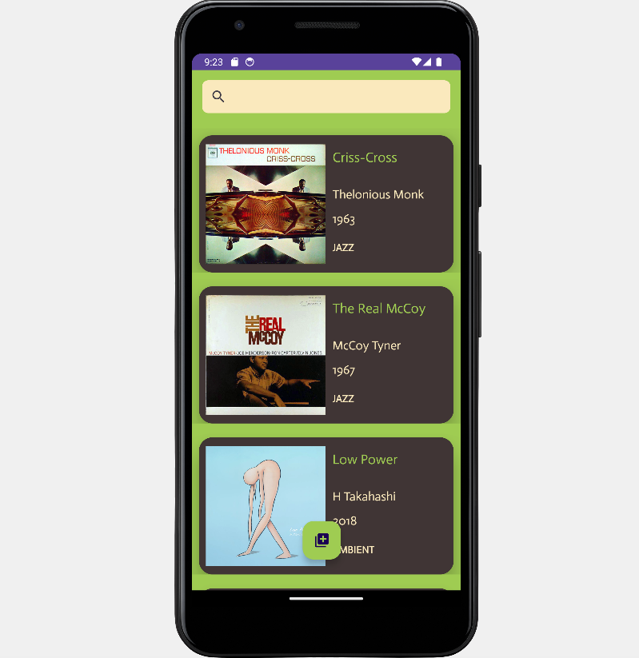

### ANDROID ALBUMS

Here's an Android app that uses my [Record Shop API](https://github.com/Alan-Turing13/record-shop) to display albums in a view.

There's functionality to post new albums, update existing ones, delete and search through the albums on user queries.

It makes use of the recycler view in the main activity, Retrofit to make the API calls, parcelable for the updates and data binding for the post, edit and delete views.

